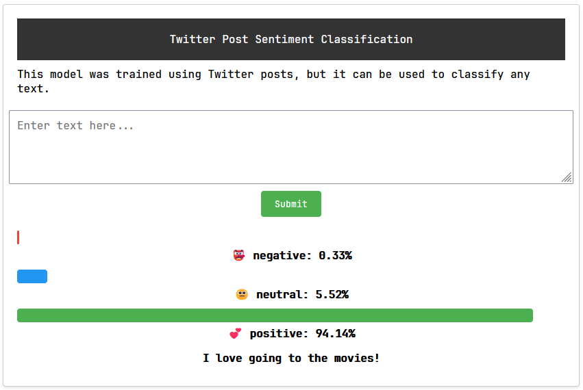
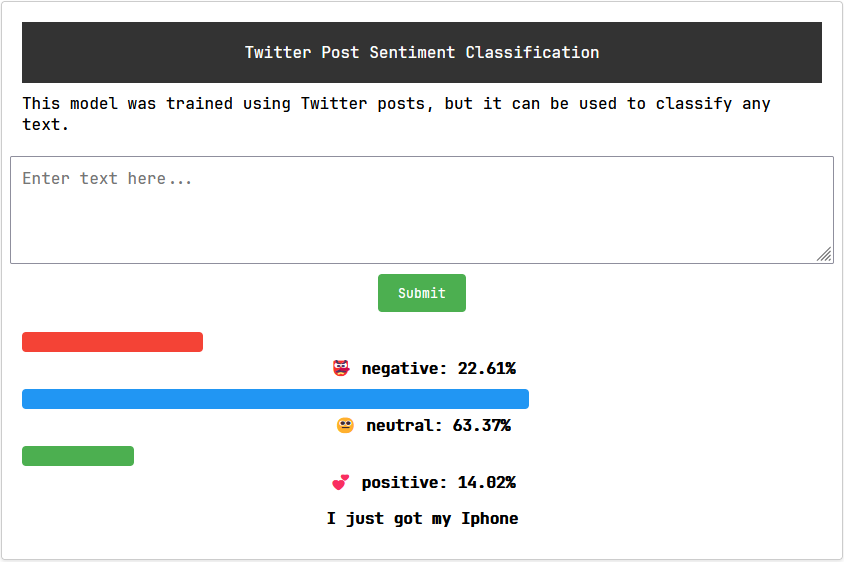

# Sentiment Classification

## Introduction

This project is a sentiment classification task. The dataset is from [Kaggle](https://www.kaggle.com/datasets/abhi8923shriv/sentiment-analysis-dataset?select=train.csv). This data contains tweets and their sentiment labels. The sentiment labels are positive, negative, and neutral. The goal of this project is to build a model to classify the sentiment of a tweet.

## Setup

1. Clone the repository

```bash
git clone https://github.com/Detopall/sentiment-prediction
```

### Server Setup

1. Install the dependencies

```bash
cd sentiment-prediction
cd server
pipenv install
```

2. Run the server

```bash
pipenv shell
python app.py
```

### Client Setup

```bash
cd sentiment-prediction
cd client
```

You can now just run the index.html file in your browser or use a live server.

## Usage

Place the message you want to test in the input field and click on the submit button. The result will be displayed below.

## Examples

**POSITIVE**


**NEUTRAL**


**NEGATIVE**
